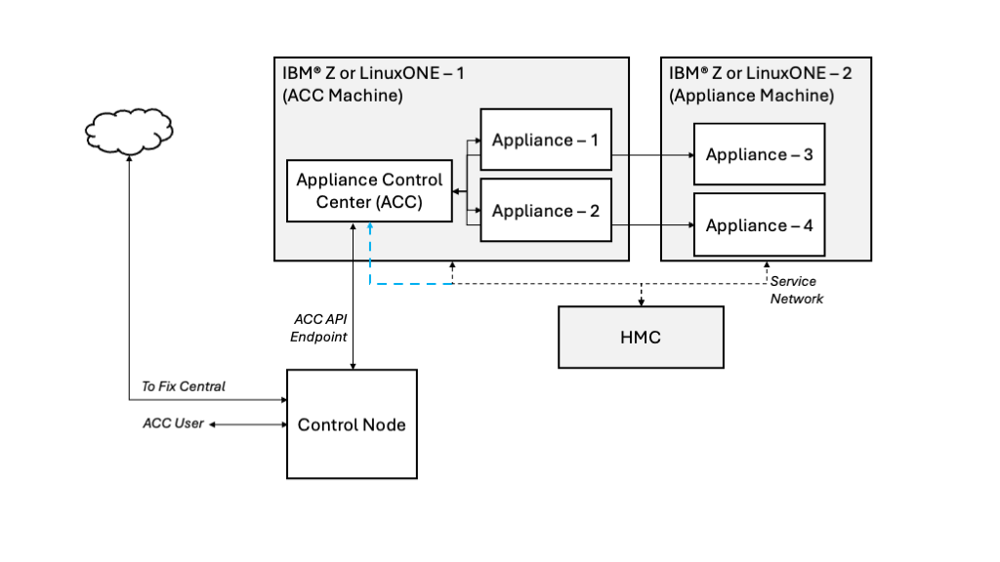
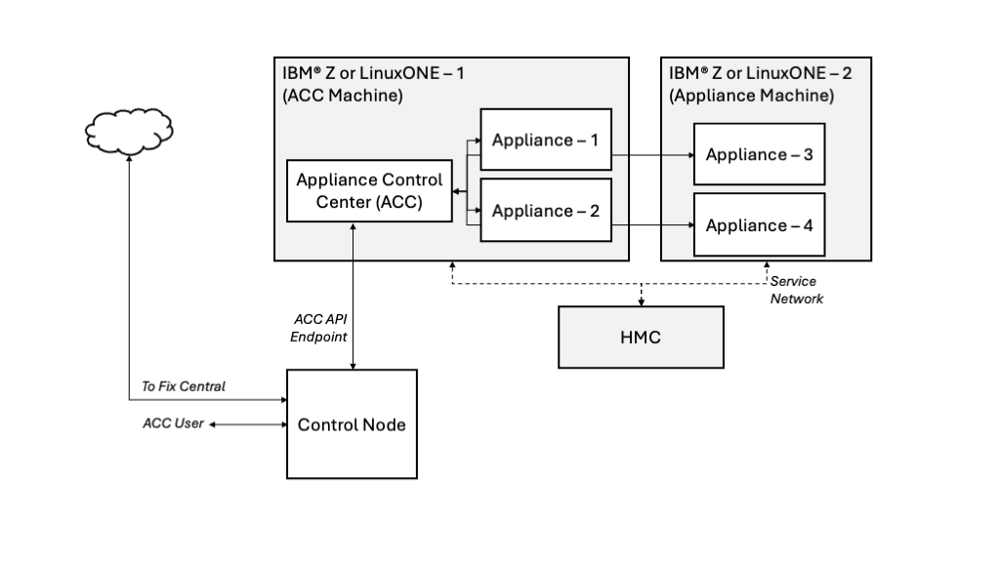
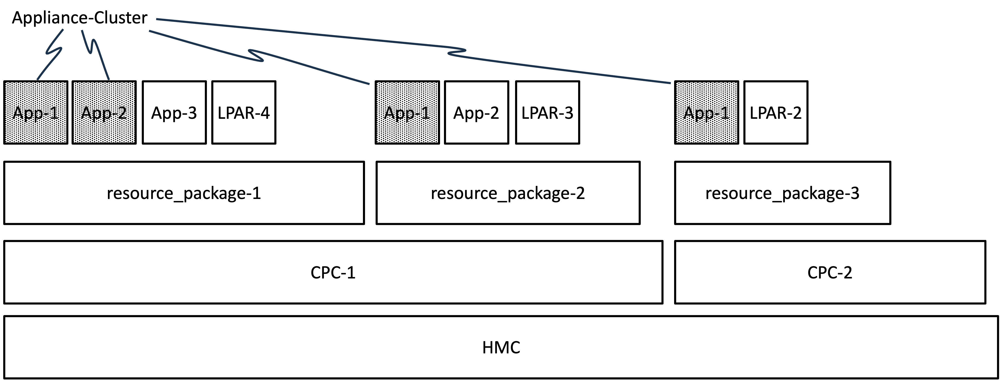
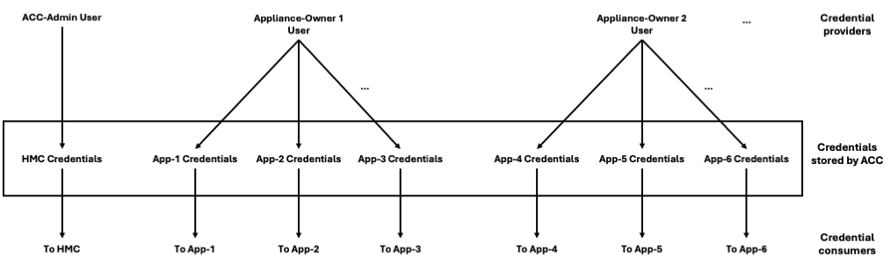
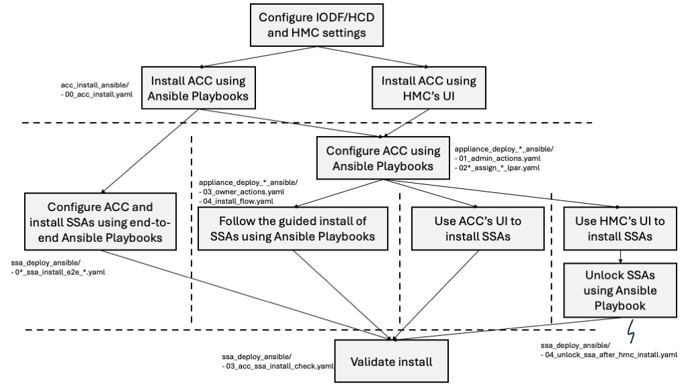

# IBM Z Appliance Control Center

**Note that these playbooks are constantly improved, and can be treated as
a draft. It is strongly advised that users always check for latest changes.**

[IBM Z Appliance Control Center](https://www.ibm.com/docs/en/systems-hardware/zsystems/9175-ME1?topic=library-appliance-control-center-z-linuxone-users-guide)
(ACC) is an IBM product to manage Secure Service Container (SSC) based appliances
on IBM Z or LinuxONE systems. You can use ACC to manage appliances like
Spyre Support Appliance (SSA).

To work efficiently with ACC, it is recommended to do the following in order:

- Read the ACC user guide.
- Use the ansible scripts.
- Check the ACC's UI.

This set of directories contains ansible playbooks that you can use against ACC to
manage appliances. These playbooks should be used as a sample. The user is
expected to understand the infrastructure of ACC and other appliances, as well
as have some understanding of setting up environment variables.

All these playbooks are tested on MacOS.

## ACC User Guide

For a detailed information about ACC, its concepts and working principles,
read the [ACC user guide](https://www.ibm.com/docs/en/module_1721331501652/pdf/GC28-7073-00.pdf).

## ACC's Basics

ACC users are strongly advised to read the ACC user guide mentioned above. Below, we
just provide a very brief introduction to important concepts of ACC.

### Personas

ACC uses two personas or roles:

#### ACC-Admin

The ACC-administrator, ACC-admin or admin for short, is the administrator of ACC.
This person will:

- Install ACC
- Configure ACC (e.g., enable MFA)
- Add HMC credentials to the ACC
- Create appliance-owners (see below)
- Assign resources to the appliance-owners
- Pull logs out of ACC

At the moment, there can only be one ACC-admin.

#### Appliance-Owner

The appliance-owner, or owner for short, is the owner of appliances that are
maintained by ACC. This person will:

- Install and/or activate appliances using ACC
- Upgrade or update these appliances
- Pull logs out of these appliances
- Unlock appliances
- Get health statues of appliances
- Login to ACC's UI

There can be many appliance-owners.

At the moment, an appliance can only have a single appliance-owner.

### Configurations

ACC can be configured in `default` mode or `standalone` mode.

#### Default Mode



In default mode, ACC can communicate with the HMC. This means that ACC can send
commands to the HMC over the network. This connectivity is denoted by the blue
arrow that connects the ACC to the network that contains the HMC.

#### Standalone Mode



In the standalone mode, ACC cannot communicate with the HMC. Some actions must
be taken manually on the HMC before using ACC. As seen, the blue arrow that
connected ACC with the network containing HMC in the default mode is no longer
there in the standalone mode.

#### Multi-Factor Authentication (MFA)

Moreover, the ACC-admin can configure each of the above default and standalone
modes with and without multi-factor authentication (MFA). This means that
whenever an ACC user wants to get an authentication token from ACC, then that
user must provide time based one time password (TOTP) to ACC in addition
to the login credentials.

### Resources

ACC uses concepts of resource packages, clusters, and quotas:



#### Resource Package

A resource package is a logical collection of resources that are assigned by the ACC-admin
to the appliance-owner. These include LPARs, IFLs/GPs, memory, disks, etc.

When assigning the resource package, the resources are not automatically consumed.
This means that if an LPAR is assigned to an appliance-owner by the ACC-admin, that
LPAR will not get activated. The "assignment" of LPAR means that the appliance-owner
can use this LPAR (e.g., the appliance-owner can activate and update this LPAR).

A resource package can only assign resources from a single CPC.

For now, a resource package can only be assigned to a single appliance-owner.

#### Resource Quota

A resource quota presents an LPAR that is activated (also called appliance). Any activated LPAR within the
resource package will have its associated resource quota in ACC. The
appliance-owner can get information about the LPAR by getting information about its
resource quota within the ACC.

#### Cluster

A logical grouping of appliances is called a cluster. Via ACC, an appliance-owner can then send
a single command to a group of appliances, that may traverse resource package boundaries.


### Execution Action

An appliance-owner can perform different actions with the LPAR while installing or activating
the LPARs. These actions are termed as execution actions.

The execution action depends upon the scenario. It depends upon the state of the LPAR/appliance
and which action is intended to be carried out. The following table outlines these actions.

| Execution action | Applicable to LPAR in state | Install new appliance | Applicable to ACC mode | Resulting ACC action |
|:-----------------|:--------------|:-------------------------|:-----------------------|:---------------------|
| `default` | Deactivated | True | Default | LPAR brought to SSC Installer mode, its profile is updated, new appliance image is then uploaded and installed onto the disk. |
| `default` | Deactivated | False | Default | LPAR profile updated, LPAR is brought up in SSC Installer mode, boot disk image is compared against the intended image to start the appliance (image is not install). |
| `switch_to_installer` | Activated as appliance | | Default and standalone | LPAR in SSC mode signaled to switch to SSC Installer mode, image not used. |
| `appliance_only` | Activated as Installer | True | Default and standalone	| Image file is uploaded to the LPAR in SSC Installer mode, appliance is installed and booted into SSC mode. |
| `appliance_only` | Activated as Installer | False | Default and standalone | Boot disk image on SSC Installer LPAR mode compared with the image that is used. If true, then LPAR activated in SSC mode. |
| `prep_lpar_only` | Deactivated | | Default | LPAR profile updated, LPAR activated in SSC Installer mode. |

More information about execution can be [found here](https://www.ibm.com/docs/en/systems-hardware/zsystems/9175-ME1?topic=linuxone-installing-appliances-using-acc-ui).

### Credentials Used in/by ACC

ACC uses the following credentials:

#### HMC Credentials in Default Mode

The HMC admin must create a single user for ACC-admin. Security-wise, the
ACC-admin user must have limited access to resources and commands.

The credentials of this user must be provided to ACC using the ACC's API. These
credentials are stored in ACC as an encrypted memory buffer, which is flushed
every 24 hours. Therefore, ACC-admin must again provide these credentials to
the ACC.

#### ACC-Admin and Appliance-Owner Credentials

The default ACC-admin credentials correspond to the ACC LPAR credentials. These default credentials must be updated using the [update password](https://www.ibm.com/docs/en/systems-hardware/zsystems/9175-ME1?topic=reference-user-management#api_reference__title__3) ACC API endpoint. These credentials must be updated before issuing any other ACC API requests.

Moreover, the ACC-admin creates credentials for the appliance-owners, and the
appliance-owners must update the credentials before sending any commands to ACC.

The hash of the passwords (for both ACC-admin and appliance-owner) are
stored by ACC and used for authentication (token generation) and authorizations.

#### Appliance Credentials

Since ACC has to manage appliances, and appliances must authenticate requests,
therefore, ACC must store these credentials. These credentials are provided by
the appliance-owner when installing the appliances using ACC.

If the appliances are already active, then the appliance-owner can provide their
credentials to the ACC using the unlock API.

#### Providers and Consumers of Credentials

The diagram below shows who provides the credentials to ACC, and how ACC uses
these credentials. For example, HMC credentials are provided by the ACC-admin,
which are used by ACC for actions on the HMC (e.g., activating LPARs).
Appliance-owners provide appliance credentials, which are the usernames and
passwords of the SSC LPARs, and ACC uses these credentials to create a token
and run actions on the appliances (e.g., updating the appliances).



  - **Note**: The diagram above does not depict a few key processes, including how the ACC administrator creates the appliance-owner credentials, how the appliance owner updates those credentials, and how ACC securely stores their hashed values.

## Playbook Directory Structure

The playbooks are organized into multiple directories, based upon the way ACC
is deployed, configured and used.

**Note**: Playbooks located in directories following the `appliance_deploy_*` naming convention are designed for environments where the previously defined [Personas](#personas) represent different individuals responsible for executing the playbooks to configure the ACC and SSA appliances.

| Directory Name | Purpose |
|:------------|:--------|
| acc_install_ansible | A directory with a playbook and scripts for installing ACC |
| appliance_deploy_default_ansible | Use these playbooks to deploy (e.g., install and activate) appliances, when ACC is configured to communicate with the HMC |
| appliance_deploy_standalone_ansible | Use these playbooks to deploy (e.g., install and activate) appliances, when ACC is not configured to communicate with the HMC |
| appliance_deploy_default_mfa_ansible | Use these playbooks to deploy (e.g., install and activate) appliances, when ACC is configured communicate with the HMC, and ACC uses MFA |
| appliance_deploy_standalone_mfa_ansible | Use these playbooks to deploy (e.g., install and activate) appliances, when ACC is not configured to communicate with the HMC, and ACC uses MFA |
| ssa_deploy_ansible | These playbooks provide an end-to-end installation and configuration workflow for a single executor, to deploy (e.g., install and activate) 2x Spyre Support Appliances (SSA) with and without MFA, when ACC is configured in default or standalone mode |
| other_usecases_ansible | Use these playbooks to use ACC for other use cases like updates, gathering logs, restarting appliances, inserting HMC credentials |

Therefore, you must consider the right directory before using these playbooks with ACC.

For example, if your focus is to install 2x SSAs using these playbooks, then
you can either use the playbooks in `appliance_deploy_*` directory, or use the
right playbook in the `ssa_deploy_ansible` directory.

### Ansible Workflow Diagram for ACC/SSA Deployment

The figure below outlines the available paths for installing ACC/SSA appliances using the playbooks mentioned in the directories listed above:



Refer to the [Spyre Accelerator Guide](https://www.ibm.com/docs/en/module_1721331501652/pdf/GC28-7071-00.pdf) for more information.

Within the above mentioned directories, you will find different examples and
use-cases for:

- Installing ACC
- Performing admin actions (e.g., initialize ACC, update admin password, set HMC, get cpc details)
- Assigning LPARs (1 or 2 LPARs)
- Owner actions (e.g., update password, upload image)
- Installation flows (e.g., install appliance for one or two LPARs)
- Pulling ACC logs
- Updating ACC image
- End-to-end installation of the appliance
- Upgrading and updating SSA image
- Pulling SSA logs and Checking health status of SSA
- Syncing LPARs
- Install checks for ACC and SSA

Please read the README.md file in the same directory, before proceeding with the playbooks.

### File Structure of acc_install_ansible

| File | Purpose |
|:---------|:--------|
| `acc_env_vars.yaml`| This file contains variables used by the ACC administrator to install ACC |
| `00_acc_install.yaml` | ACC administrator can use this playbook to install ACC, and it will use the scripts in `acc_install_ansible` directory |

This directory contains a playbook `00_acc_install.yaml`, a variable file
`acc_env_vars.yaml`, and scripts that help with installation of
ACC. The user should update the environment variables and then run this
playbook for installing ACC. The playbook will call the other scripts in this
directory.

Therefore, it is not expected for the user to modify or deeply understand the
process behind these scripts. However, it is required that the user reads the
`README.md` file in this directory before continuing with the installation of ACC.

### File Structure of appliance_deploy_*_ansible

These files are used to deploy appliances.

| File | Purpose |
|:---------|:--------|
| `admin_vars.yaml` | This file contains variables used by the ACC administrator to initialize ACC and assign resources to the appliance owners |
| `owner_vars.yaml` | This file contains variables used by the appliance owners to install their appliances |
| `01_admin_actions.yaml` | ACC administrator can use this playbook to initialize ACC |
| `02a_assign_1_lpar.yaml` | ACC administrator can use this playbook to assign a single LPAR to an appliance owner |
| `02b_assign_2_lpar.yaml` | ACC administrator can use this playbook to assign two LPARs to an appliance owner |
| `03_owner_actions.yaml` | Appliance owner can use this playbook to initialize the user on ACC |
| `04_install_flow.yaml` | Appliance owner can use this playbook to install and activate an appliance |

### File Structure of ssa_deploy_ansible

This directory has the following ansible playbooks:

| File | Purpose |
|:---------|:--------|
| `env_vars.yaml` | This file contains variables that can be used to configure ACC and SSAs |
| `01_ssa_install_e2e_default.yaml` | This playbook provides an end-to-end workflow, for initializing ACC in default mode, and installing and activating 2x SSAs |
| `02_ssa_install_e2e_standalone.yaml` | This playbook provides an end-to-end workflow, for initializing ACC in standalone mode, and installing and activating 2x SSAs |
| `03_acc_ssa_install_check.yaml` | This playbook can be used to check and validate that the ACC and 2x SSAs are active and reachable |
| `04_unlock_ssa_after_hmc_install.yaml` | This playbook is used to bring the 2x SSAs under ACC management when the SSAs are installed using the HMC |

### File Structure of other_usecases_ansible

This directory is used for other use cases associated with ACC and appliances.

| File | Purpose |
|:---------|:--------|
| `env_vars.yaml` | This file contains variables used by the environment, e.g., to install 2x SSAs |
| `owner_vars.yaml` | This file contains variables used by the appliance owners regarding their appliances |
| `acc_ssa_install_check_vars.yaml` | This file contains variables used for checking ACC and 2x SSA installations |
| `00_resource_scan.yaml`| Appliance owner can use this playbook to gather information about the resources assigned and consumed by the owner |
| `01_upgrade_flow.yaml` | Appliance owner can use this playbook to upgrade an appliance, which will format the disk and install a new appliance |
| `02_sync_cpc_lpars.yaml` | ACC administrator can use this playbook to sync the state of the CPCs on the HMC, and LPARs. |
| `03_pull_ssc_logs.yaml` | ACC administrator can use this playbook to pull logs out of an SSC appliance like ACC |
| `04_managed_appliance_update.yaml` | Appliance owner can use this playbook to update currently running appliances |
| `05_managed_appliance_health_and_pull_logs.yaml` | Appliance owner can use this playbook to gather health status of the appliances and pull their logs |
| `06_acc_appliance_update.yaml` | ACC administrator can use this playbook to update ACC |
| `07_insert_hmc_creds.yaml` | ACC administrator can use this playbook to insert HMC credentials into ACC when ACC is in the default mode |
| `08_restart_acc.yaml` | ACC administrator can use this playbook to restart ACC |
| `09_get_disruptive_dumps.yaml` | This playbook can be used by the ACC administrator to pull disruptive dumps/logs out of the appliances |
| `10_unlock_appliances.yaml` | This playbook can be used by the appliance owners to unlock their appliances |
| `11_unlock_each_appliances.yaml` | This playbook can be used in conjunction with `10_unlock_appliances.yaml` |
| `12_logout_owner.yaml` | The appliance-owner can use this playbook to logout of ACC |
| `13_restart_appliances.yaml` | The appliance-owner can use this playbook to restart appliances that are managed by ACC |

## ACC Features and Limitations

It is recommended to read the release notes of each ACC release for
up-to-date information about ACC and the list of features, limitations,
and future plans.

We provide a brief overview of these aspects but they might not be
up-to-date.

### List of ACC Features

- Appliance management (install, activate, deactivate, update) on DPM and non-DPM mode machine.
- Working in default mode (ACC connected to the HMC) and standalone mode (ACC not connected to the HMC).
- Uploading appliances for installation.
- Basic sanity checks before installation.
- Appliance upgrade (complete image replacement) and updates.
- Appliance cluster management actions (install, activate, deactivate, update).
- Downloading logs of appliances.
- Health monitoring of appliances.
- ACC user management.
- Sync with HMC on LPARs running appliances in default mode.
- Rest APIs and sample ansible scripts for managing appliances.
- Basic UI functions for managing appliance.
- Multifactor authentication.
- Providing an opportunity to the ACC-Admin to upload certificates.

### Current Limitations of ACC

See the notes [here](https://www.ibm.com/docs/en/module_1721331501652/pdf/SC28-7067-00.pdf).

## Troubleshooting

As a result of executing the playbooks in this repository, the ACC LPAR appliance may occasionally enter a failed or unresponsive state. You can use the [ACC API](https://www.ibm.com/docs/en/systems-hardware/zsystems/9175-ME1?topic=guide-api-reference) to restore the appliance to a healthy condition.

Refer to the [Troubleshooting](https://www.ibm.com/docs/en/systems-hardware/zsystems/9175-ME1?topic=guide-troubleshooting)
chapter of the user-guide.

Here are some useful examples:

### Obtaining a Token

You will need a token to communicate with ACC. To generate the token, you can use
the following API example.

```bash
curl -k -X 'POST' \
  "https://${ACC_IP}:${ACC_PORT}/api/user/token" \
  -H 'accept: application/json' \
  -H 'Content-Type: application/json' \
  -d '{
  "username": "your_username",
  "password": "your_password"
}'
```

This will return a JSON object, with an `access_token` field containing the token to be used for communicating with the ACC.
You can export the `access_token` to an appropriate environment variable, such as `ADMIN_TOKEN` or `OWNER_TOKEN`, depending on the credentials used above, for reuse in later ACC API calls.

Note that the `ACC_IP` is the IP of the ACC LPAR, and the `ACC_PORT` is 8081.

### Deleting the Resource Package

If as an ACC-admin, you have assigned wrong resources to the appliance-owner,
you must delete and re-create the resource package.

For that purpose, use the following resource package deletion API example below.

```bash
curl -k -X 'DELETE' \
  "https://${ACC_IP}:${ACC_PORT}/api/resource/pkgs/${RESOURCE_PKG}?owner=${ACC_OWNER_USERNAME}" \
  -H 'accept: */*' \
  -H "Authorization: Bearer ${ADMIN_TOKEN}" \
  -H 'Content-Type: application/json'
```

If the resource package cannot be deleted because of already activated LPARs,
then use the `force=true` parameter like:

```bash
/api/resource/pkgs/${RESOURCE_PKG}?owner=${ACC_OWNER_USERNAME}&force=true
```

Afterwards, you can re-create the resource package for the owner.

### Getting Task Status

If as an appliance-owner, you are executed a long running task, then you can
get the status of that task by running the following API:

```bash
curl -k -X GET \
    "https://${ACC_IP}:${ACC_PORT}/api/tasks/${TASK_ID}/status" \
    -H "Authorization: Bearer ${OWNER_TOKEN}"
```

### Handling Timeouts when Adding HMC Configuration

Using the `/api/config/hmcconfig`, ACC-admin can add information about the CPCs
and the LPARs on the HMC to the default mode ACC. However, if the HMC is
handling multiple CPCs (e.g., >20), then a timeout can occur. This is because
ACC pulls information about the CPCs and all their LPARs from the HMC as a
blocking call to the HMC.

This API call is sent by multiple playbooks whenever ACC-admin sends a command
to sync the ACC with the HMC.

Whenever a timeout occurs, the playbook that calls this API will fail. However,
even after the failure in the playbook, ACC will still sync with the
HMC in the background and gather CPC information.

Therefore, after some time, the user should check the CPC information available
in the ACC using the `GET /api/cpcs` API to check if ACC has successfully
finished synching with the HMC:

```bash
curl -k -X 'GET' \
  "https://${ACC_IP}:${ACC_PORT}/api/cpcs" \
  -H 'accept: application/json' \
  -H "Authorization: Bearer ${ADMIN_TOKEN}"
```

The above API will pull the information from the ACC about the CPCs that ACC is
currently handling. If this list is complete, then ACC had successfully synced
with the HMC. And when running the playbook again, the ACC user can comment
out or remove the task that calls the `/api/config/hmcconfig` API.

Moreover, it is advisable that no other activity is triggered by the user of the ACC when HMC 
syncing is in progress.
