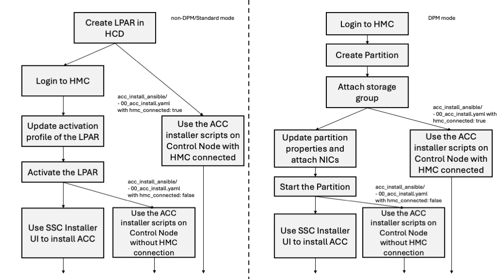

# Appliance Control Center Installer Ansible Script

## Preparation

## Installing ACC - Preparations

To install ACC, the following actions must be performed on the HMC
and your control node.



**Note**: The following steps are tested and verified on MacOS terminal.
Windows users can either use Windows Subsystem for Linux (WSL) or run equivalent
commands of the ones described below. Linux users can use terminal to
run the commands.

- Download the ACC installation image from Fix Central and store it on your
  control node (i.e., your laptop).
- Ensure the control node (your laptop) and ACC IP address have sufficient
  authority and are added to the appropriate HMC whitelist to allow for proper
  communication to the HMC.
- Ensure that in the HMC, the Secure Service Container (SSC) based ACC LPAR
  activation profile is created and is updated with correct values of network
  settings. (`chpid`, `prefix`, `fid`, etc.) and storage (initial 16 GB storage is required for ACC).
- Both ACC-admin and appliance-owners must
  [install ansible](https://docs.ansible.com/ansible/latest/installation_guide/intro_installation.html) on
  their respective control nodes.
  - For example, on your laptop that will connect with ACC, install `ansible` via:

    ```bash
    pip install ansible
    ```
  
- Download this directory and the `acc_install_ansible` directory on
  the control node (e.g., a laptop), which will connect with ACC.
- Install the following software on your control node.

### Verify OpenSSL Installation
  
  Before proceeding, ensure that OpenSSL is installed on your system. Verify the OpenSSL installation
  with the following command:

  ```Linux
  openssl version
  ```

  You should see output similar to:

  ```linux
  OpenSSL 3.5.1 1 Jul 2025
  ```

  If OpenSSL isn’t installed, install it using your system’s package manager. On macOS, you can install OpenSSL via Homebrew using the following command:

  ```mac
  brew install openssl@3
  ```

### System Requirements

  - Ansible (must already be installed)
  - Python 3.x
  - sshpass

**Note**:

- The ansible playbook does not automatically install `packages`.
- If `sshpass` is missing, the playbook will stop with an error. Install it manually depending on your OS.

### Python Packages

The following python packages are required to be installed within a python virtual environment for successful execution of the ACC installation playbook:

- click
- click_shell
- zhmcclient
- urllib3

To setup a python virtual environment and install the required packages, please execute the following procedure:

- `cd` to the `../acc_install_ansible` directory on your control node (laptop).
- Run the command:

  ```bash
  python3 -m venv venv
  ```

- Afterwards, run the following commands to enter the python virtual environment,
  install the required python packages, and exit the virtual environment:

  ```bash
  source venv/bin/activate
  pip install click click_shell zhmcclient urllib3
  deactivate
  ```

- Lastly, confirm OpenSSL has been linked to your Python virtual environment:
  Activate your virtual environment and check the OpenSSL version with the following commands:

  ```Linux
  source venv/bin/activate
  python -c "import ssl; print(ssl.OPENSSL_VERSION)"
  deactivate
  ```

  - **Note:** If you see an error such as `ModuleNotFoundError: No module named 'ssl'`, please ensure OpenSSL has been [installed](#verify-openssl-installation)
      on your system.

## ACC Appliance Installation - 00_acc_install.yaml

To set up the ACC, the following actions must be performed by the ACC-admin.

- Set the ACC user's HMC username and password by using the `export` command
  in a terminal on your control node (laptop) to create the `HMC_USER` and
  `HMC_PASSWORD` variables. For example:

  ```bash
  export HMC_USER=<enter_HMC_username>
  export HMC_PASSWORD=<enter_HMC_password>
  ```

- Set the ACC-admin's username and default password by using the `export`
  command in a terminal on your control node (laptop) to create the
  `ACC_ADMIN_USER` and `ACC_ADMIN_DEFAULT_PASSWORD` variables:

  ```bash
  export ACC_ADMIN_USER=<admin_username>
  export ACC_ADMIN_DEFAULT_PASSWORD=<admin_password>
  ```

  `lpar_username` and `lpar_password` are the ACC's SSC LPAR's credentials.
  These credentials are used by ACC-admin later as well, when initializing ACC.
  Moreover, the password must adhere to the following rules:
  - Length: 15-128 characters.
  - Valid characters: letters, digits, special characters (`-_#!@$%&?`).
  - Must have at least one lower case, one upper case, one digit, one special
    character.
  - Must not include the username.
- Update the variables in the file (`acc_install_ansible/acc_env_vars.yaml`):
  - Change the `IMAGE_PATH` in the `acc_env_vars.yaml` file.
  - Change the `CPC`, `LPAR`, `LPAR_IP`, `DISK_ID` in the `acc_env_vars.yaml` file.
    - If you plan to use FCP instead of a DASD disk to install ACC, ensure that all required
      FCP variables are properly configured. Set the `IS_FCP` variable to true, and specify
      the `lun` and `wwpn` values in `the acc_env_vars.yaml` file.
      - **Note**: When using FCP, the `DISK_ID` variable represents the FCP device number used to communicate with the `lun` on the storage controller.
- Run the following playbook to install ACC:

  ```bash
  ansible-playbook ./acc_install_ansible/00_acc_install.yaml
  ```

If the above python virtual environment and packages within the virtual environment are missing, the playbook will display an error message and stop running.

The above step will take time (about 15 mins) to complete. The scripts begin by setting up the ACC LPAR, followed by uploading the ACC image and installing it on the LPAR.

Check the status of ACC LPAR on the HMC for successful installation. After this
step is completed, ACC will be installed and running.
