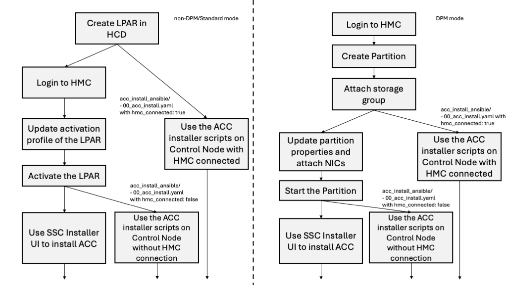

# Appliance Control Center Installer Ansible Script



In essence, there are 3 ways to install ACC:

1. Use the HMC's UI to install ACC. This way is useful if you have familiarity
   with the HMC's UI.
2. Use the provided ansible playbook `00_acc_install.yaml` to install ACC
   by sending commands from the control node (the machine that will run the
   `00_acc_install.yaml` playbook) to the HMC. This way is helpful in storing
   the infrastructure information in form of variables and automated install of ACC.
   This way is recommended.
3. Use the provided ansible playbook `00_acc_install.yaml` to install ACC
   on an already activated LPAR in SSC Installer mode. This way is helpful
   if you do not have access to the HMC's UI and the control node cannot
   send commands to the HMC.

**Note**: The following steps are tested and verified on MacOS terminal.
Windows users can either use Windows Subsystem for Linux (WSL) or run equivalent
commands of the ones described below. Linux users can use terminal to
run the commands.

## Installing ACC - Preparations

To install ACC, the following actions must be performed on the HMC
and your control node.

- Download the ACC installation image from Fix Central and store it on your
  control node (i.e., your laptop).
- Download this directory (`acc_install_ansible`) on
  the control node (e.g., a laptop), which will connect with ACC and if required, with
  the HMC.
- Modify the `acc_env_vars.yaml` file.
- If the control node can communicate with the HMC, then set the variable `hmc_connected`
  to `true` in the `acc_env_vars.yaml` file. Otherwise, keep it to `false`.
- With `hmc_connected: true`, ensure that control node (your laptop) and ACC IP address have sufficient
  authority and are added to the appropriate HMC whitelist to allow for proper
  communication to the HMC.
- With `hmc_connected: false`, login to HMC and perform appropriate actions like:
  - Ensure that in the HMC, the Secure Service Container (SSC) based ACC LPAR
    activation profile is created and is updated with correct values of network
    settings. (`chpid`, `prefix`, `fid`, etc.) and storage (initial 16 GB storage is required for ACC).
  - For DPM based machine, also connect the storage group to the partition.
  - Activate the LPAR in SSC installer mode.
  - Provide the IP of the ACC LPAR to the `LPAR_IP` variable in the `acc_env_vars.yaml` file.

Moreover, install the following software on your control node.

### Install Ansible

- Both ACC-admin and appliance-owners must
  [install ansible](https://docs.ansible.com/ansible/latest/installation_guide/intro_installation.html) on
  their respective control nodes.
  - For example, on your mac, Linux or Windows (WSL) machine that will connect with ACC, install `ansible` via:

    ```bash
    pip install ansible
    ```

### Verify OpenSSL Installation
  
Before proceeding, ensure that OpenSSL is installed on your system. Verify the OpenSSL installation
with the following command:

```Linux
openssl version
```

You should see output similar to:

```linux
OpenSSL 3.5.1 1 Jul 2025
```

If OpenSSL isn’t installed, install it using your system’s package manager.
On macOS, you can install OpenSSL via Homebrew using the following command:

```mac
brew install openssl@3
```

### System Requirements

- Ansible (must already be installed)
- Python 3.x
- `sshpass`

**Note**:

- The ansible playbook does not automatically install `packages`.
- If `sshpass` is missing, the playbook will stop with an error. Install it manually depending on your OS.

### Python Packages

The following python packages are required to be installed within a python virtual environment for successful execution of the ACC installation playbook:

- click
- click_shell
- zhmcclient
- urllib3

To setup a python virtual environment and install the required packages, please execute the following procedure:

- `cd` to the `../acc_install_ansible` directory on your control node (laptop).
- Run the command:

  ```bash
  python3 -m venv venv
  ```

  - _**Note:** Depending on your python installation and the version you intend to use, the python command may differ slightly from the example above. In some environments, `python` may be used instead of `python3`. Ensure that the correct python binary is available in your `PATH`. The `--version` flag can be used to confirm which python version is being invoked_

- Afterwards, run the following commands to enter the python virtual environment,
  install the required python packages, and exit the virtual environment:

  ```bash
  source venv/bin/activate
  pip install click click_shell zhmcclient urllib3
  deactivate
  ```

- Lastly, confirm OpenSSL has been linked to your Python virtual environment:
  Activate your virtual environment and check the OpenSSL version with the following commands:

  ```Linux
  source venv/bin/activate
  python -c "import ssl; print(ssl.OPENSSL_VERSION)"
  deactivate
  ```

  - **Note:** If you see an error such as `ModuleNotFoundError: No module named 'ssl'`, please ensure OpenSSL has been [installed](#verify-openssl-installation)
      on your system.

## ACC Appliance Installation - 00_acc_install.yaml

To set up the ACC, the following actions must be performed by the ACC-admin.

- With `hmc_connected: true`, set the ACC user's HMC username and password by using the `export` command
  in a terminal on your control node (laptop) to create the `HMC_USER` and
  `HMC_PASSWORD` variables. For example:

  ```bash
  export HMC_USER=<enter_HMC_username>
  export HMC_PASSWORD=<enter_HMC_password>
  ```

- Set the ACC-admin's username and default password by using the `export`
  command in a terminal on your control node (laptop) to create the
  `ACC_ADMIN_USER` and `ACC_ADMIN_DEFAULT_PASSWORD` variables:

  ```bash
  export ACC_ADMIN_USER=<admin_username>
  export ACC_ADMIN_DEFAULT_PASSWORD=<admin_password>
  ```

  The `admin_username` is actually the ACC's `lpar_username` and
  the `admin_password` is the ACC's `lpar_password`. These are the
  ACC's SSC LPAR's credentials. With `hmc_connected: true`, the playbook
  will automatically set the credentials of the LPAR and install ACC on the
  LPAR. With `hmc_connected: false`, these credentials must be provided by
  the HMC admin who has activated the LPAR in SSC Installer mode. These
  credentials are equal to `Administrator user ID` and `Administrator password`
  on the image activation profile on the HMC.

  These credentials are used by ACC-admin later as well, when initializing ACC.
  Moreover, the password must adhere to the following rules:
  - Length: 15-128 characters.
  - Valid characters: letters, digits, special characters (`-_#!@$%&?`).
  - Must have at least one lower case, one upper case, one digit, one special
    character.
  - Must not include the username.
- Update the variables in the file (`acc_install_ansible/acc_env_vars.yaml`):
  - Change the `IMAGE_PATH` in the `acc_env_vars.yaml` file.
  - Change the `CPC`, `LPAR`, `LPAR_IP`, `DISK_ID` in the `acc_env_vars.yaml` file.
    - If you plan to use FCP instead of a DASD disk to install ACC, ensure that all required
      FCP variables are properly configured. Set the `IS_FCP` variable to true, and specify
      the `lun` and `wwpn` values in `the acc_env_vars.yaml` file.
      - **Note**: When using FCP, the `DISK_ID` variable represents the FCP device number used to communicate with the `lun` on the storage controller.
  - Change the `NW_IP`, `NW_FID`, `NW_GW_IP` and other network related
    variables in the `acc_env_vars.yaml` file.
    - If you plan to use FID instead of a OSA card, then do not keep
      `NW_FID` empty. If `NW_FID` variable is empty, then the scripts
      will use the `NW_CHPID`, `NW_PORT` for the ACC LPAR.
  - Change the `IFLS` and `GPS` variables in the `acc_env_vars.yaml`
    file to select the number of shared IFLs or GPs for the LPAR.
    - Either use `IFLS` or `GPS`. If using `IFLS`, then make `GPS` 0
      and vice-versa. If both are non-zero, the playbook will throw
      an error.
    - Note that the IFLs or GPs on the ACC LPAR are shared, and they
      use an initial processing weight of `10`.
- Run the following playbook to install ACC:
  ```bash
  ansible-playbook ./acc_install_ansible/00_acc_install.yaml
  ```

The above step will take time (about 15 mins) to complete. The scripts begin by setting
up the ACC LPAR, followed by uploading the ACC image and installing it on the LPAR.
Check the status of ACC LPAR on the HMC for successful installation. After this
step is completed, ACC will be installed and running.

## Problems

If the above python virtual environment and packages within the virtual environment are missing, the playbook will display an error message and stop running.

---

If you receive an error like:
```
User not allowed to use APIs
```
then you would need to enable Web Services API on the HMC for the
user that was set in the `HMC_USER` variable. Contact the HMC admin.

---

If using the `hmc_connected: true`, then these scripts will update the
following attributes of the LPAR (see HMC Webservices API for
reference):

- `number-shared-ifl-processors`
- `number-shared-general-purpose-processors`
- `initial-ifl-processing-weight`
- `processor-usage`
- `central-storage`
- `ssc-boot-selection`
- `ssc-master-userid`
- `ssc-master-pw`
- `ssc-gateway-info`
- `ssc-network-info`

Therefore, it is possible that old settings on the LPAR are still
intact after running these scripts. Therefore, the caller must take
care, and check if there are other settings that might impact the
deployment.

If you get errors like the following:

```
Unhandled exception occurred in image_action: 500,281:
setActivationProfile exception: System exception <P>The exception is a
system-related problem.  This may be accompanied by hardware messages.
<P>Try the operation again.  If the problem persists, contact your
service representative. 
```

then,

- Login to the HMC UI.
- Update and save the activation profile of the ACC LPAR using the
  expected values.
- Try again installing ACC with the provided playbook.

---

In case of any problems, it is recommended to check the `Operating system messages`
and other related information on the HMC.
