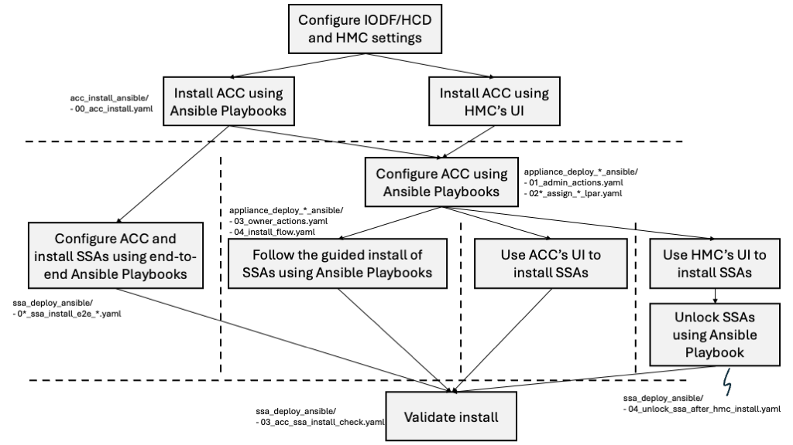

# Ansible Playbooks for Deploying IBM AI Optimizer for IBM Z and IBM Linux ONE

These playbooks provide installation and configuration of IBM AI Optimizer for IBM Z and IBM Linux ONE Application on the Appliance Control Center (ACC).

## Prerequisites

### Step 1: Install and Configure ACC/SSA

**IMPORTANT:** Before running any AI Optimizer installation playbooks, you must first install and configure the Appliance Control Center (ACC) / Secure Service Container Appliance (SSA).

#### Installation Flow

Follow the complete ACC/SSA installation flow diagram:



Refer to the [SSA Deployment Ansible Playbooks](../ssa_deploy_ansible/README.md) for detailed instructions on:
- Installing ACC LPAR
- Initializing ACC Appliance
- Configuring ACC Admin Credentials
- Setting up HMC integration (default mode) or CPC configuration (standalone mode)
- Configuring SSA Owner Credentials
- Installing SSA LPAR(s)

#### Verify ACC/SSA Installation

Before proceeding with AI Optimizer installation, verify that ACC and SSA are properly installed and accessible:

1. **Check ACC and SSA LPAR Status:**
   - Verify the ACC and SSA LPARs are activated and operational on the HMC
   - Ensure network connectivity to the ACC and SSA LPAR works

2. **Validate ACC and SSA Health:**
   - Switch to the directory `ssa_deploy_ansible`.
   - Update the variables in the `env_vars.yaml` file.
   - Run the automated SSA verification playbook ([03_acc_ssa_install_check.yaml](../ssa_deploy_ansible/03_acc_ssa_install_check.yaml)):
     ```bash
     ansible-playbook 03_acc_ssa_install_check.yaml
     ```
   If both ACC and SSA are healthy and the Spyre cards are working as expected, the above playbook will complete without failure.

3. **Test ACC UI Login:**
   - Access ACC UI at `https://<ACC_IP>:8081`
   - Login with appliance owner credentials
   - Verify you can access the dashboard

4. **Confirm HMC Integration (Default Mode Only):**
   - In ACC UI, check that HMC is connected
   - Verify CPC information is visible
   - Ensure LPARs are discoverable

5. **Verify CPC Configuration (Standalone Mode Only):**
   - Confirm CPC information has been registered in ACC
   - Check that resource quotas (IFLs, GPs, memory) are correctly configured

**⚠️ Do not proceed with AI Optimizer installation until ACC/SSA is fully operational and verified.**

---

## AI Optimizer Installation (Default Mode) | 01_install_aio_default.yaml

Install IBM AI Optimizer for IBM Z and IBM Linux ONE in default mode where ACC communicates with the HMC.

### Pre-requisites

- **ACC/SSA must be installed, configured, and verified** (see Step 1 above)
- AI Optimizer LPAR must be **deactivated** on HMC before execution
- **Important:** If the playbook must be re-run due to task failures, any of the following tasks that might have completed successful on previous playbook execution, **MUST** be commented out within the playbook. Failing to do so will lead to further playbook failures:
  ```linux
   01 - Create an appliance-owner in ACC for IBM AI Optimizer for IBM Z and IBM Linux ONE Application appliance
   02 - Assign resources in ACC to the IBM AI Optimizer for IBM Z and IBM Linux ONE appliance-owner created in step 01
   04 - Update the password of IBM AI Optimizer for IBM Z and IBM Linux ONE Application appliance-owner
   06 - Upload the IBM AI Optimizer for IBM Z and IBM Linux ONE Application appliance image to the ACC
  ```
- **Note:** If an error occurs during or after task 06, use the `retry` tag to skip all the tasks listed above in the playbook without needing to comment them out:
  ```bash
  ansible-playbook 01_install_aio_default.yaml -t retry
  ```

### Procedure

1. Export owner passwords (follow [ACC API password rules](https://www.ibm.com/docs/en/systems-hardware/zsystems/9175-ME1?topic=reference-user-management#api_reference__title__3)):
   ```bash
   export ACC_AIO_OWNER_DEFAULT_PASSWORD=<aio_owner_default_password>
   export ACC_AIO_OWNER_PASSWORD=<aio_owner_new_password>
   ```

2. Export appliance credentials:
   ```bash
   export AIO_USERNAME=<aio_appliance_username>
   export AIO_PASSWORD=<aio_appliance_password>
   ```

3. Download and store the AI Optimizer installation image from Passport Advantage
4. Update all variables in `env_vars_aiopt.yaml` (do not comment out any variables)
5. Run the playbook:
   ```bash
   ansible-playbook 01_install_aio_default.yaml
   ```

### Important

#### Network Card Type Selection (OSA/NETH)

The playbook prompts for network card type:
```
Enter network card type to be used for LPAR <LPAR_NAME>: (OSA/NETH)
```

Select based on configuration:
- **OSA** → when you have CHPID and Port
- **NETH** → when you have FID

VLAN configuration prompt:
```
Does the LPAR <LPAR_NAME> need VLAN configuration? (yes/no)
```

Ensure `vlan*_id` variables are set in `env_vars_aiopt.yaml` if VLAN is required.

**Warning:** Incorrect selection will misconfigure HMC network and may make LPAR unreachable.

#### Disk Type Selection (FCP/DASD)

Select correct disk type:
- **FCP disk** → provide valid `wwpn*` and `lun*` values
  - Note: `disk*_id` represents the FCP device number for storage controller communication
- **DASD disk** → `wwpn` and `lun` not required

Installation takes 30+ minutes. The playbook polls task status and retries automatically.

## AI Optimizer Installation (Standalone Mode) | 02_install_aio_standalone.yaml

Install IBM AI Optimizer for IBM Z and IBM Linux ONE in standalone mode where ACC cannot communicate with HMC.

### Pre-requisites

- **ACC/SSA must be installed, configured, and verified** (see Step 1 above)
- AI Optimizer LPAR must be in **SSC Installer mode** on HMC before execution
- **Important:** If the playbook must be re-run due to task failures, comment out successfully completed tasks:
  ```linux
      01 - Create an appliance-owner in ACC for IBM AI Optimizer for IBM Z and IBM Linux ONE Application appliance
      02 - Assign resources in ACC to the IBM AI Optimizer for IBM Z and IBM Linux ONE appliance-owner created in step 01
      04 - Update the password of IBM AI Optimizer for IBM Z and IBM Linux ONE Application appliance-owner
      06 - Upload the IBM AI Optimizer for IBM Z and IBM Linux ONE Application appliance image to the ACC
  ```
- **Note:** If error occurs during/after task 06, use retry tag:
  ```bash
  ansible-playbook 02_install_aio_standalone.yaml -t retry
  ```

### Procedure

1. Export owner passwords (follow [ACC API password rules](https://www.ibm.com/docs/en/systems-hardware/zsystems/9175-ME1?topic=reference-user-management#api_reference__title__3)):
   ```bash
   export ACC_AIO_OWNER_DEFAULT_PASSWORD=<aio_owner_default_password>
   export ACC_AIO_OWNER_PASSWORD=<aio_owner_new_password>
   ```

2. Export appliance credentials (set by HMC administrator in SSC Installer):
   ```bash
   export AIO_USERNAME=<aio_appliance_username>
   export AIO_PASSWORD=<aio_appliance_password>
   ```

3. Download and store the AI Optimizer installation image from Password Advantage
4. Update all variables in `env_vars_aiopt.yaml` (do not comment out any variables)
   - Pay special attention to standalone-specific variables (e.g., `cpc_ifls`, `cpc_gps`, `available_storage`)
5. Run the playbook:
   ```bash
   ansible-playbook 02_install_aio_standalone.yaml
   ```

### Important

#### Network Card Type Selection (OSA/NETH)

The playbook prompts for network card type:
```
Enter network card type to be used for LPAR <LPAR_NAME>: (OSA/NETH)
```

Select based on configuration:
- **OSA** → when you have CHPID and Port
- **NETH** → when you have FID

VLAN configuration prompt:
```
Does the LPAR <LPAR_NAME> need VLAN configuration? (yes/no)
```

Ensure `vlan*_id` variables are set in `env_vars_aiopt.yaml` if VLAN is required.

**Warning:** Incorrect selection will misconfigure HMC network and may make LPAR unreachable.

#### Disk Type Selection (FCP/DASD)

Select correct disk type:
- **FCP disk** → provide valid `wwpn*` and `lun*` values
  - Note: `disk*_id` represents the FCP device number for storage controller communication
- **DASD disk** → `wwpn` and `lun` not required

Installation takes 30+ minutes. The playbook polls task status and retries automatically.

---

## Post-Installation Verification | 03_verify_aio_installation.yaml

After successful installation, verify that AI Optimizer is properly deployed and operational.

### Procedure

Run the verification playbook:
```bash
ansible-playbook 03_verify_aio_installation.yaml
```

This playbook will:
- Check ACC operational status
- Check AI Optimizer appliance operational status
- Verify appliance authentication via API

### Verification Output

The playbook provides a summary including:
- ACC IP and operational status
- AI Optimizer appliance IP and operational status
- Authentication status
- Next steps for accessing the UI

### Next Steps After Verification

1. **Access AI Optimizer UI:**
   ```
   https://<appliance_ip>
   ```

2. **Login with appliance credentials:**
   - Username: Value from `app_username` in `env_vars_aiopt.yaml`
   - Password: Value from `app_password` in `env_vars_aiopt.yaml`

3. **Verify Spyre Cards:**
   - Navigate to **Deploy LLM** in the UI
   - Go to **Select GPU cards** section
   - Available Spyre cards will be displayed
   - **Note:** Spyre card availability can be verified through the UI while deploying LLMs

4. **Deploy Your First LLM:**
   - Follow the UI to deploy an LLM model
   - Select required Spyre cards for the deployment
   - Configure model parameters
   - Start the deployment

---

## Configuration File

All infrastructure-specific values are defined in `env_vars_aiopt.yaml`. Update this file with your environment details before running any playbook.

## Performance Note

**Network Connectivity:** The system from which the Ansible scripts are executed should have fast network connectivity to the ACC LPAR to reduce the required installation time due to the large image size. Slow network connections will significantly increase the image upload time during image upload tasks.
