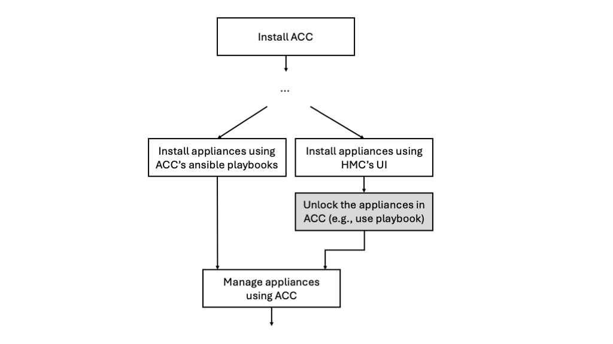

# Ansible Playbooks for Different Use Cases

The playbooks in this directory cover multiple use cases that might arise when
working with ACC and appliances.

These playbooks can be used for:

- Pulling ACC logs
- Updating ACC image
- End-to-end installation of the appliance
- Upgrading and updating appliance images
- Pulling logs and checking health status of appliances
- Syncing LPARs
- Inserting HMC credentials
- Unlocking appliances
- Restarting ACC
- Logging out of ACC

The use cases here cover the `default` mode of ACC, with or without MFA enabled.
If MFA is enabled by the ACC-admin, ensure that you save the admin's and
owner's `mfa_secret`s.

## Preparation

- Almost all the playbooks here require that ACC and the appliances under
  consideration are activated and working as expected.
- Both ACC-admin and appliance-owners must
  [install ansible](https://docs.ansible.com/ansible/latest/installation_guide/intro_installation.html) on
  their respective control nodes.
  - For example, on your laptop that will connect with ACC, install `ansible` via:
    ```bash
    pip install ansible
    ```
- Download this repository on the control node (e.g., a
  laptop) which will connect with ACC.
- The playbooks that are run by an appliance-owner require to export the owner password
  on a terminal in your control node (laptop):
  ```bash
  export ACC_OWNER_PASSWORD=<owner_password>
  ```
- `cd` to the directory `other_usecases_ansible`.
- Modify the variables in the file `owner_vars.yaml`.
  - Change the `acc_ip` in the `owner_vars.yaml` file to point to the right
    IP address. Change this IP and port to the one that should be serving ACC APIs.

## Updating the Appliances - 01_upgrade_flow.yaml | 04_managed_appliance_update.yaml

An appliance can be upgraded (wiping the complete disk and replacing it with the
new image) or concurrently updated by the appliance-owner. Since these playbooks
change the disk image and restart the appliances, therefore, it is strongly
recommended to backup your data before proceeding.

`01_upgrade_flow.yaml` playbook should be used when you want to
completely overwrite the disk of the appliance. This playbook will therefore,
delete your data on the disk.

The `04_managed_appliance_update.yaml` should be used when you get a `fix` from
the appliance team and you want to install that `fix` on your appliance. This
playbook might delete all your unsaved data.

To upgrade or update an appliance, perform the following actions as
appliance-owner.

- Download the appliance image you want to install to your control node (e.g., 
  your laptop).
- Modify the location of that image file for upgrade in the `owner_vars.yaml` file.
  - Specifically, change the `image_path` variable.
  - This image is used for both upgrade and concurrent/fix update.
  - The variable `image_type` denotes the kind of update:
    - Set the `image_type` variable to `image` for upgrade.
      - Run the playbook for appliance upgrade:
        ```bash
        ansible-playbook 01_upgrade_flow.yaml
        ```
    - Set the `image_type` variable to `fix` for concurrent update.
      - Run the playbook for appliance concurrent :
        ```bash
        ansible-playbook 04_managed_appliance_update.yaml
        ```

## Sync ACC with HMC | 02_sync_cpc_lpars.yaml

ACC-admin can sync the state of CPCs and LPARs with the HMC. This is needed when
an action is performed on the HMC and its must be reflected on the ACC.

ACC provides two APIs: one to sync the state of the CPCs and the other to sync
the state of the LPARs.

ACC supports two operational modes: `default` and `standalone`, and the syncing 
behavior of ACC with the HMC changes based on the mode.

### Synching in Default Mode

In default mode of ACC, whenever CPC or LPAR sync API of ACC is called, ACC
starts syncing its internal database to reflect the latest state of CPCs and
LPARs in the HMC.

This becomes helpful in scenarios when:

- A CPC is re-configured or removed from the HMC.
- An LPAR action is performed on the HMC but the LPAR was activated by the ACC.
  For example, if the LPAR was earlier activated via ACC but someone on the HMC
  deactivates it, this playbook will sync the state of the LPAR in ACC.

### Synching in Standalone Mode

In standalone mode of ACC, only the LPAR sync API is supported because ACC cannot communicate with the HMC, but it can communicate with the LPARs.

This becomes helpful in scenarios when:

- An LPAR action is performed on the HMC but the LPAR was managed by the ACC.
  For example, if the LPAR was earlier activated in appliance mode via ACC but
  someone on the HMC changes it to installer mode, this playbook will sync the
  state of the LPAR in ACC.

### Procedure

Run the playbook:
```bash
ansible-playbook 02_sync_cpc_lpars.yaml
```

**Note**: The LPARs must be unlocked before this playbook is run.

## Pull Logs from ACC and other Appliances | 03_pull_ssc_logs.yaml

- Run the playbook to get logs from ACC:
  ```bash
  ansible-playbook 03_pull_ssc_logs.yaml
  ```

This playbook will interactively ask for the IP, username and password of the
SSC LPAR of the appliance, from which logs are gathered. This means that this playbook can also be
used for gathering logs from other appliances (e.g., SSA appliance).

## Pull SSA logs and Check Health Status | 05_managed_appliance_health_and_pull_logs.yaml

- Run the playbook for health checking and pulling appliance (like SSA) logs:
  ```bash
  ansible-playbook 05_managed_appliance_health_and_pull_logs.yaml
  ```

## ACC Appliance Update | 06_acc_appliance_update.yaml

- Run the playbook to update the ACC appliance:
  ```bash
  ansible-playbook 06_acc_appliance_update.yaml
  ```

This playbook is different than `01_upgrade_flow.yaml`, because this playbook
should be used to upgrade ACC itself. The `01_upgrade_flow.yaml` playbook is
used to upgrade an appliance that is managed by ACC.

## Set HMC Credentials (Daily Task) | 07_insert_hmc_creds.yaml

The administrator must run the following Ansible playbook once every day to
refresh and set the HMC credentials in ACC.

For this purpose:

- Export the username and password in a terminal on your control node
  (laptop), via which the ACC will communicate with the HMC:
  ```bash
  export HMC_USER=<enter_HMC_username>
  export HMC_PASSWORD=<enter_HMC_password>
  ```
- Run the playbook:
  ```bash
    ansible-playbook 07_insert_hmc_creds.yaml
  ```

### Caution:

Using the `/api/config/hmcconfig`, this playbook adds information about the CPCs
and the LPARs on the HMC to the default mode ACC. However, if the HMC is
handling multiple CPC (e.g., >20), then a timeout can occur. This is because
ACC pulls information about the CPCs and all their LPARs from the HMC as a
blocking call to the HMC.

Whenever a timeout occurs, this playbook will fail. However,
even after the failure in the playbook, ACC will still sync with the
HMC in the background and gather CPC information.

Therefore, after some time, the user should check the CPC information available
in the ACC using the `GET /api/cpcs` API to check if ACC has successfully 
finished synching with the HMC:

```bash
curl -k -X 'GET' \
  "https://${ACC_IP}:${ACC_PORT}/api/cpcs" \
  -H 'accept: application/json' \
  -H "Authorization: Bearer $ADMIN_TOKEN"
```

The above API will pull the information from the ACC about the CPCs that ACC is
currently handling. If this list is complete, then ACC had successfully synced
with the HMC.

Moreover, it is advisable that no other activity is triggered by user of the
ACC when synching with HMC is in progress.

## Restart ACC | 08_restart_acc.yaml

If the ACC-admin wants to restart ACC, then ACC-admin can use this playbook:

```
ansible-playbook 08_restart_acc.yaml
```

This playbook will help user to restart ACC, which can be helpful in certain conditions.

Note: This playbook will not deactivate and then activate the ACC LPAR. It will
just send a restart signal to ACC appliance (similar to `reboot`).

## Trigger and Collect Disruptive dumps from Appliance | 09_get_disruptive_dumps.yaml

This playbook automates the process of triggering a disruptive dump on an SSC appliance
and collecting diagnostic logs after the reboot.  Handle with care, as you might lose unsaved data
on your appliances.

For starting and collecting disruptive dumps, run the playbook `09_get_disruptive_dumps.yaml`.

```bash
ansible-playbook 09_get_disruptive_dumps.yaml
```

This playbook with interactively ask for the IP, username, password, reason for
downloading dumps and file path where to download for gathering logs from any
appliances (e.g., SSA appliance).

## Unlock Appliances | 10_unlock_appliances.yaml | 11_unlock_each_appliance.yaml

This playbook allows the appliance-owner to unlock one or more locked appliances in their resource package.
Each appliance will be processed one at a time, prompting the user for credentials specific to that appliance.

Run this playbook as the appliance-owner.
```bash
ansible-playbook 10_unlock_appliances.yaml
```

To successfully run the above command, the file `11_unlock_each_appliance.yaml` must
be available in the same directory. This file is included by the main playbook
(`10_unlock_appliances.yaml`) for each appliance.

This playbook becomes valuable when a user has already set up the appliances
using HMC and wants them to be managed by ACC. For example, if the user has
already set up SSA appliances using the HMC, but wants to manage and monitor
them via ACC, then use this playbook.



## Appliance-Owner Log Out from ACC | 12_logout_owner.yaml

This playbook allows the appliance-owner to log out of ACC. All tokens of the
current appliance-owner are then invalidated. New token must be created by the
owner afterwards, if the owner wants to communicate again with ACC.

This means that if the appliance-owner runs this playbook and the owner is also
logged in to the UI, the owner will also be logged out of the UI (and any other
place where the owner has created a token to communicate with ACC).

To logout:

- Export the appliance-owner password in a terminal on your control node
  (laptop):
  ```bash
  export ACC_OWNER_PASSWORD=<owner_password>
  ```
- Run this playbook as the appliance-owner.
  ```bash
  ansible-playbook 12_logout_owner.yaml
  ```

## Appliance Restart via ACC | 13_restart_appliances.yaml

ACC provides an API to restart appliances. The appliance-owner can use the
playbook `13_restart_appliances.yaml` to restart the appliances. A restart
request can be sent to multiple appliances using this playbook.

To restart the appliances, follow the procedure:

- Export the appliance-owner password in a terminal on your control node
  (laptop):
  ```bash
  export ACC_OWNER_PASSWORD=<owner_password>
  ```
- If haven't already, 'unlock' the appliances using the `10_unlock_appliances.yaml` playbook.
- Run the playbook:
  ```bash
  ansible-playbook 13_restart_appliances.yaml
  ```
