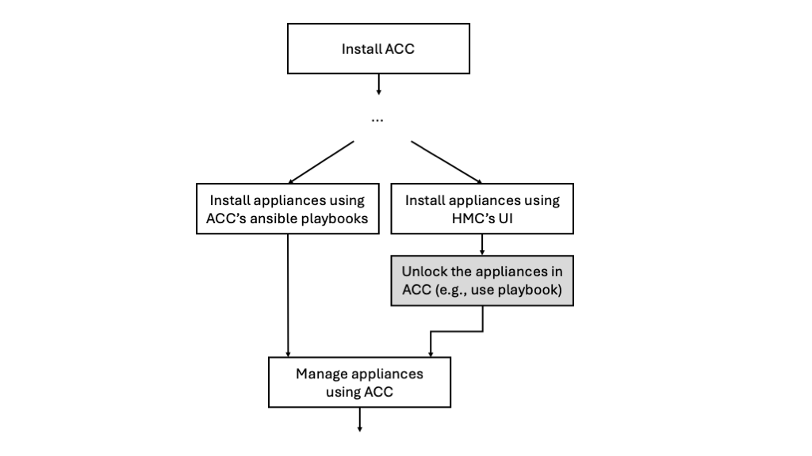

# Ansible Playbooks for Different Use Cases

The playbooks in this directory cover multiple use cases that might arise when
working with ACC and appliances.

These playbooks can be used for:

- Pulling ACC logs
- Updating ACC image
- End-to-end installation of the appliance
- Upgrading and updating appliance images
- Pulling logs and checking health status of appliances
- Syncing LPARs
- Inserting HMC credentials
- Unlocking appliances
- Restarting ACC
- Logging out of ACC
- Exporting ACC configuration
- Restoring ACC configuration (post-process task, available from ACC version 1.2.10 and above)
- Gathering comprehensive ACC logs (tasks, history, audit, about, and appliance logs)
- Getting ACC about information


The use cases here cover the `default` mode of ACC, with or without MFA enabled.
If MFA is enabled by the ACC-admin, ensure that you save the admin's and
owner's `mfa_secret`s.

## Preparation

- Almost all the playbooks here require that ACC and the appliances under
  consideration are activated and working as expected.
- Both ACC-admin and appliance-owners must
  [install ansible](https://docs.ansible.com/ansible/latest/installation_guide/intro_installation.html) on
  their respective control nodes.
  - For example, on your laptop that will connect with ACC, install `ansible` via:
    ```bash
    pip install ansible
    ```
- Download this repository on the control node (e.g., a
  laptop) which will connect with ACC.
- The playbooks that are run by an appliance-owner require to export the owner password
  on a terminal in your control node (laptop):
  ```bash
  export ACC_OWNER_PASSWORD=<owner_password>
  ```
- `cd` to the directory `other_usecases_ansible`.
- Modify the variables in the file `owner_vars.yaml`.
  - Change the `acc_ip` in the `owner_vars.yaml` file to point to the right
    IP address. Change this IP and port to the one that should be serving ACC APIs.

## Updating the Appliances - 01_upgrade_flow.yaml | 04_managed_appliance_update.yaml

An appliance can be upgraded (wiping the complete disk and replacing it with the
new image) or concurrently updated by the appliance-owner. Since these playbooks
change the disk image and restart the appliances, therefore, it is strongly
recommended to backup your data before proceeding.

`01_upgrade_flow.yaml` playbook should be used when you want to
completely overwrite the disk of the appliance. This playbook will therefore,
delete your data on the disk.

The `04_managed_appliance_update.yaml` should be used when you get a `fix` from
the appliance team and you want to install that `fix` on your appliance. This
playbook might delete all your unsaved data.

To upgrade or update an appliance, perform the following actions as
appliance-owner.

### 01_upgrade_flow.yaml

Use `01_upgrade_flow.yaml` when you want to perform a full appliance upgrade
using an uploaded image.

- Download the appliance image you want to install to your control node.
- Update `owner_vars.yaml`:
  - `image_path`: path to the upgrade image file
  - `package_name`: resource package that owns the target appliance
  - `lpar_name`: target LPAR name
  - `acc_url`: ACC API endpoint
- Export the required environment variable:
  ```bash
  export ACC_OWNER_PASSWORD=<owner_password>
  ```
- Run the playbook:
  ```bash
  ansible-playbook 01_upgrade_flow.yaml
  ```

Behavior of this playbook:
- Prompts for MFA OTP if MFA is enabled.
- Uploads the image to ACC.
- If the same image already exists for the current owner, the playbook lets you:
  - continue with an existing uploaded image, or
  - stop and re-run after deleting/changing the image
- If you continue with an existing image, the playbook lists all available images
  and asks you to select the image ID interactively.
- Sends the cluster upgrade request using the selected/uploaded image ID.
- Saves the upgrade response body to the path configured by
  `upgrade_appliance_data`.
- Saves response headers to:
  `{{ upgrade_appliance_data }}.headers`
- Fails the playbook if ACC returns HTTP `400`, while still preserving the
  downloaded response for inspection.
- Prints a warning if ACC returns HTTP `207`.

### 04_managed_appliance_update.yaml

Use `04_managed_appliance_update.yaml` when you want to apply a concurrent
update/fix bundle to an existing appliance.

- Update `owner_vars.yaml`:
  - `update_bundle_path`: path to the update bundle file
  - `package_name`: resource package that owns the target appliance
  - `lpar_name`: target LPAR name
  - `acc_url`: ACC API endpoint
- Export the required environment variables:
  ```bash
  export ACC_OWNER_PASSWORD=<owner_password>
  ```
- Run the playbook:
  ```bash
  ansible-playbook 04_managed_appliance_update.yaml
  ```

Behavior of this playbook:
- Prompts for MFA OTP if MFA is enabled.
- Uploads the fix/update bundle to ACC.
- Detects HTML error responses from the upload step and fails with a clearer
  message for invalid requests or authentication problems.
- If the same image already exists for the current owner, the playbook lets you:
  - continue with an existing uploaded image, or
  - stop and re-run after deleting/changing the image
- If you continue with an existing image, the playbook lists all available images
  and asks you to select the image ID interactively.
- Unlocks quota for discovered running appliances by prompting for username and password interactively for each appliance.
- Starts the concurrent update using the selected/uploaded image ID.
- Saves the update response ZIP to the path configured by `upgrade_fix_data`.
- Prints a warning if ACC returns HTTP `207`.

## Sync ACC with HMC | 02_sync_cpc_lpars.yaml

ACC-admin can sync the state of CPCs and LPARs with the HMC. This is needed when
an action is performed on the HMC and its must be reflected on the ACC.

ACC provides two APIs: one to sync the state of the CPCs and the other to sync
the state of the LPARs.

ACC supports two operational modes: `default` and `standalone`, and the syncing 
behavior of ACC with the HMC changes based on the mode.

### Synching in Default Mode

In default mode of ACC, whenever CPC or LPAR sync API of ACC is called, ACC
starts syncing its internal database to reflect the latest state of CPCs and
LPARs in the HMC.

This becomes helpful in scenarios when:

- A CPC is re-configured or removed from the HMC.
- An LPAR action is performed on the HMC but the LPAR was activated by the ACC.
  For example, if the LPAR was earlier activated via ACC but someone on the HMC
  deactivates it, this playbook will sync the state of the LPAR in ACC.

### Synching in Standalone Mode

In standalone mode of ACC, only the LPAR sync API is supported because ACC cannot communicate with the HMC, but it can communicate with the LPARs.

This becomes helpful in scenarios when:

- An LPAR action is performed on the HMC but the LPAR was managed by the ACC.
  For example, if the LPAR was earlier activated in appliance mode via ACC but
  someone on the HMC changes it to installer mode, this playbook will sync the
  state of the LPAR in ACC.

### Procedure

Run the playbook:
```bash
ansible-playbook 02_sync_cpc_lpars.yaml
```

**Note**: The LPARs must be unlocked before this playbook is run.

## Pull Logs from ACC and other Appliances | 03_pull_ssc_logs.yaml

- Run the playbook to get logs from ACC:
  ```bash
  ansible-playbook 03_pull_ssc_logs.yaml
  ```

This playbook will interactively ask for the IP, username and password of the
SSC LPAR of the appliance, from which logs are gathered. This means that this playbook can also be
used for gathering logs from other appliances (e.g., SSA appliance).

**Note**: This playbook now uses the reusable `17_tasks_pull_ssc_logs.yaml` tasks file, which contains the core log gathering logic. This same tasks file is also used by `18_gather_acc_logs.yaml` for consistency.

Note that this playbook waits and then asks the SSC appliance
whether the alert is handled by the appliance. If the alert is not yet
handled, the playbook will print `FAILED - RETRYING: ...` message on
the terminal, and then retry the query after a pause. Please let the
playbook run and give enough time for the appliance to handle the
alert. Afterwards, the playbook will run normally.

## Pull SSA logs and Check Health Status | 05_managed_appliance_health_and_pull_logs.yaml

- Run the playbook for health checking and pulling appliance (like SSA) logs:
  ```bash
  ansible-playbook 05_managed_appliance_health_and_pull_logs.yaml
  ```

## ACC Appliance Update | 06_acc_appliance_update.yaml

- Run the playbook to update the ACC appliance:

  ```bash
  ansible-playbook 06_acc_appliance_update.yaml
  ```

This playbook is different than `01_upgrade_flow.yaml`, because this playbook
should be used to upgrade ACC itself. The `01_upgrade_flow.yaml` playbook is
used to upgrade an appliance that is managed by ACC.

Note that this playbook waits and then asks the ACC appliance
to get ready for an update and also check its status after the update.
If ACC appliance is not yet in the right state, the playbook will
print `FAILED - RETRYING: ...` message on the terminal, and then retry
the operations after a pause. Please let the
playbook run and give enough time for the ACC appliance to handle the
requests. Afterwards, the playbook will run normally.

**Note**: If the ACC LPAR does not reboot as part of the appliance update process, be aware that the operating system messages shown for the ACC LPAR in the HMC may display stale ACC version information.

With the [jq](https://jqlang.org/download/) package installed on your system, the following `curl` commands can be used to verify the ACC version:

- Obtain zACI ACC_Admin Token

  ```Linux
  export ADMIN_TOKEN=$(curl -k -X 'POST' \
    'https://{ACC_IP}/api/com.ibm.zaci.system/api-tokens' \
    -H 'Accept: application/vnd.ibm.zaci.payload+json' \
    -H 'zACI-API: com.ibm.zaci.system/1.0' \
    -H 'Content-Type: application/vnd.ibm.zaci.payload+json;version=1.0' \
    -d '{
      "kind": "request",
      "parameters": {
        "user": "acc_admin_username",
        "password": "acc_admin_password"
       }
     }' | jq -r '.parameters.token')
  
  ```

  - Be sure to replace `{ACC_IP}` with the IP address of the ACC LPAR, and substitute `acc_admin_username` and `acc_admin_password` with the appropriate ACC administrator credentials.

- Query ACC Status Information

  ```Linux
  curl -k -X "GET" \
    "https://{ACC_IP}/api/com.ibm.zaci.system/appliance/" \
    -H "Accept: application/vnd.ibm.zaci.payload+json" \
    -H "zACI-API: com.ibm.zaci.system/1.0" \
    -H "Authorization: Bearer ${ADMIN_TOKEN}" \
    -H "Content-Type: application/vnd.ibm.zaci.payload+json;version=1.0" | jq
  ```

- Sample Response:

  ```Linux
  {
    "kind": "instance",
    "self": "/api/com.ibm.zaci.system/appliance/",
    "resource-name": "appliance",
    "resource-version": "1.0",
    "properties": {
      "self": "/api/com.ibm.zaci.system/appliance",
      "name": "zAppliance Control Center",
      "description": "zAppliance Control center - zACC",
      "version": "1.2.11",
      ...
  ```

## Set HMC Credentials (Daily Task) | 07_insert_hmc_creds.yaml

The administrator must run the following Ansible playbook once every day to
refresh and set the HMC credentials in ACC.

For this purpose:

- Export the username and password in a terminal on your control node
  (laptop), via which the ACC will communicate with the HMC:
  ```bash
  export HMC_USER=<enter_HMC_username>
  export HMC_PASSWORD=<enter_HMC_password>
  ```
- Run the playbook:
  ```bash
    ansible-playbook 07_insert_hmc_creds.yaml
  ```

### Optional: HMC Credential Expiry

This playbook now supports an optional parameter to set an expiry time for HMC credentials.
When prompted during playbook execution:

- **Enter a number between 1-14** to set the HMC credentials to expire after that many days
- **Leave empty** (press Enter) - on leaving empty we do not pass credential expiry time and hence ACC takes the default expiry of 1 day

### Caution:

Using the `/api/config/hmcconfig`, this playbook adds information about the CPCs
and the LPARs on the HMC to the default mode ACC. However, if the HMC is
handling multiple CPC (e.g., >20), then a timeout can occur. This is because
ACC pulls information about the CPCs and all their LPARs from the HMC as a
blocking call to the HMC.

Whenever a timeout occurs, this playbook will fail. However,
even after the failure in the playbook, ACC will still sync with the
HMC in the background and gather CPC information.

Therefore, after some time, the user should check the CPC information available
in the ACC using the `GET /api/cpcs` API to check if ACC has successfully 
finished synching with the HMC:

```bash
curl -k -X 'GET' \
  "https://${ACC_IP}:${ACC_PORT}/api/cpcs" \
  -H 'accept: application/json' \
  -H "Authorization: Bearer $ADMIN_TOKEN"
```

The above API will pull the information from the ACC about the CPCs that ACC is
currently handling. If this list is complete, then ACC had successfully synced
with the HMC.

Moreover, it is advisable that no other activity is triggered by user of the
ACC when synching with HMC is in progress.

## Restart ACC | 08_restart_acc.yaml

If the ACC-admin wants to restart ACC, then ACC-admin can use this playbook:

```
ansible-playbook 08_restart_acc.yaml
```

This playbook will help user to restart ACC, which can be helpful in certain conditions.

Note: This playbook will not deactivate and then activate the ACC LPAR. It will
just send a restart signal to ACC appliance (similar to `reboot`).

Note that this playbook waits and then checks the ACC appliance
whether it is booted up or not. If the ACC appliance is not yet
booted, the playbook will print `FAILED - RETRYING: ...` message on
the terminal, and then retry the check after a pause. Please let the
playbook run and give enough time for the ACC appliance to reboot.
Afterwards, the playbook will run normally.

## Trigger and Collect Disruptive dumps from Appliance | 09_get_disruptive_dumps.yaml

This playbook automates the process of triggering a disruptive dump on an SSC appliance
and collecting diagnostic logs after the reboot.  Handle with care, as you might lose unsaved data
on your appliances.

For starting and collecting disruptive dumps, run the playbook `09_get_disruptive_dumps.yaml`.

```bash
ansible-playbook 09_get_disruptive_dumps.yaml
```

This playbook with interactively ask for the IP, username, password, reason for
downloading dumps and file path where to download for gathering logs from any
appliances (e.g., SSA appliance). Afterwards, the appliance will
reboot itself.

Note that this playbook waits and then checks the SSC appliance
whether it is booted up or not. If the SSC appliance is not yet
booted, the playbook will print `FAILED - RETRYING: ...` message on
the terminal, and then retry the check after a pause. Please let the
playbook run and give enough time for the SSC appliance to reboot.
Afterwards, the playbook will run normally.

## Unlock Appliances | 10_unlock_appliances.yaml | 11_unlock_each_appliance.yaml

This playbook allows the appliance-owner to unlock one or more locked appliances in their resource package.
Each appliance will be processed one at a time, prompting the user for credentials specific to that appliance.

Run this playbook as the appliance-owner.
```bash
ansible-playbook 10_unlock_appliances.yaml
```

To successfully run the above command, the file `11_unlock_each_appliance.yaml` must
be available in the same directory. This file is included by the main playbook
(`10_unlock_appliances.yaml`) for each appliance.

This playbook becomes valuable when a user has already set up the appliances
using HMC and wants them to be managed by ACC. For example, if the user has
already set up SSA appliances using the HMC, but wants to manage and monitor
them via ACC, then use this playbook.



## Appliance-Owner Log Out from ACC | 12_logout_owner.yaml

This playbook allows the appliance-owner to log out of ACC. All tokens of the
current appliance-owner are then invalidated. New token must be created by the
owner afterwards, if the owner wants to communicate again with ACC.

This means that if the appliance-owner runs this playbook and the owner is also
logged in to the UI, the owner will also be logged out of the UI (and any other
place where the owner has created a token to communicate with ACC).

To logout:

- Export the appliance-owner password in a terminal on your control node
  (laptop):
  ```bash
  export ACC_OWNER_PASSWORD=<owner_password>
  ```
- Run this playbook as the appliance-owner.
  ```bash
  ansible-playbook 12_logout_owner.yaml
  ```

**Note**: In the ACC versions older than 1.2.12, the `/user/logout` API of
ACC used `DELETE` instead of `POST`. If you are using ACC version older than
1.2.12, then replace the `method: POST` with `method: DELETE` in the
`04 - Logout appliance-owner` task.

## Appliance Restart via ACC | 13_restart_appliances.yaml

ACC provides an API to restart appliances. The appliance-owner can use the
playbook `13_restart_appliances.yaml` to restart the appliances. A restart
request can be sent to multiple appliances using this playbook.

To restart the appliances, follow the procedure:

- Export the appliance-owner password in a terminal on your control node
  (laptop):
  ```bash
  export ACC_OWNER_PASSWORD=<owner_password>
  ```
- If haven't already, 'unlock' the appliances using the `10_unlock_appliances.yaml` playbook.
- Run the playbook:
  ```bash
  ansible-playbook 13_restart_appliances.yaml
  ```

## Export ACC Configuration | 14_acc_export_config.yaml

This playbook allows the ACC administrator to export the current ACC configuration
to a file. The exported configuration can be used to restore ACC to a previous
state in case of failures or to migrate configuration to another ACC instance.

The playbook will:
- Authenticate with ACC using admin credentials
- Export the ACC configuration
- Save the configuration file with a timestamp in the filename
- Display the export location with a security reminder

**Important**: The exported configuration file should be saved to a secure location
as it may contain sensitive information. You will need this file to restore ACC
configuration in case of failures.

To export ACC configuration:

- Update the variables in `export_import_vars.yaml`:
  - Set the `export_dir` to specify where the configuration file should be saved
  - Set the `lpar_name` if needed for your environment
- Run the playbook:
  ```bash
  ansible-playbook 14_acc_export_config.yaml
  ```
- The playbook will prompt for:
  - ACC IP address
  - ACC admin username
  - ACC admin password

The exported file will be saved with a timestamp in the format:
`{LPAR_NAME}_ACC_config_{TIMESTAMP}.data`

## Restore ACC Configuration | 15_acc_restore_config.yaml

This playbook allows the ACC administrator to restore a previously exported ACC
configuration. This is useful for:
- Recovering from configuration errors
- Restoring ACC after a failure
- Migrating configuration between ACC instances

The playbook will:
- Validate that the import file exists
- Display import file information including filename with timestamp
- Extract and display metadata from the import file (comment, date, message type)
- Pause for 10 seconds before importing to allow review
- Import the configuration and apply it
- Wait for ACC to restart and become operational
- Re-authenticate after the restart
- Post-install script is executed after the config import(available from ACC 1.2.10 and above)

**Important**: Restoring configuration will overwrite the current ACC configuration
and restart the ACC appliance. Ensure you have a backup of the current configuration
before proceeding.

To restore ACC configuration:

- Ensure you have a previously exported configuration file
- Run the playbook:
  ```bash
  ansible-playbook 15_acc_restore_config.yaml
  ```
- The playbook will prompt for:
  - ACC IP address
  - ACC admin username
  - ACC admin password
  - Full path to the exported configuration file

The playbook will display the import file metadata and pause for 10 seconds before proceeding with the import, giving you time to verify the correct file is being used.

## Gather Comprehensive ACC Logs | 18_gather_acc_logs.yaml

This playbook provides a unified solution for gathering all ACC-related logs and information in a single execution. It automatically detects the user role (ACC-admin or appliance-owner) and collects appropriate logs based on permissions.

**Code Reuse**: Both this playbook and `03_pull_ssc_logs.yaml` use the same `17_tasks_pull_ssc_logs.yaml` tasks file for appliance log gathering. This ensures:
- Single source of truth for log gathering logic
- Consistent behavior across playbooks
- Easier maintenance and bug fixes

The playbook gathers:
- **Tasks log**: Last n tasks from ACC
- **History log**: Last n history operations from ACC
- **About information**: ACC version and configuration details
- **Audit logs**: Available only for ACC-admin users
- **Appliance logs**: Available only for ACC-admin users (requires appliance credentials)

All logs are organized in a timestamped directory structure:
```
acc_logs/
└── acc_logs_YYYYMMDD_HHMMSS/
    ├── tasks.log
    ├── history.log
    ├── about.log
    ├── audit_logs/
    │   └── audit_logs_YYYYMMDD_HHMMSS.zip
    ├── app_logs/
    │   └── ssc_YYYYMMDD_HHMMSS.gz
    └── SUMMARY.txt
```

### Features

- **Uses vars file**: Reads ACC URL from `owner_vars.yaml` (consistent with other playbooks)
- **Interactive prompts**: Minimal prompts for credentials and parameters
- **Role-based access**: Automatically detects user role and adjusts log collection
- **MFA support**: Handles Multi-Factor Authentication if enabled
- **Graceful error handling**: Skips tasks that fail due to insufficient permissions
- **Comprehensive summary**: Generates a summary file with collection status

### Prerequisites

Before running the playbook, ensure you have configured `owner_vars.yaml` with the `acc_url` variable (e.g., `https://9.152.150.225:8081/api`)

### Usage

Run the playbook:
```bash
ansible-playbook 18_gather_acc_logs.yaml
```

The playbook will interactively prompt for:
1. ACC username (ACC-admin or appliance-owner)
2. ACC password
3. Number of recent tasks to retrieve (default: 100)
4. Number of recent history operations to retrieve (default: 100)
5. MFA OTP (if MFA is enabled)
6. Appliance credentials (if ACC-admin and wants to gather appliance logs)

### Role-Based Behavior

**For ACC-admin users:**
- Collects all logs including audit logs
- Optionally collects appliance diagnostic logs (requires appliance credentials)
- Full access to all ACC APIs

**For appliance-owner users:**
- Collects tasks, history, and about information
- Skips audit logs (requires admin privileges)
- Skips appliance logs (requires admin privileges)

### Notes

- The playbook creates a new timestamped directory for each execution
- Failed API calls are handled gracefully and logged in the summary
- Appliance log collection may take several minutes as it waits for the appliance to generate diagnostic information
- All logs are saved in JSON format for easy parsing and analysis

### Example Output

After successful execution, you'll see:
```
========================================
Log collection completed successfully!
========================================

All logs have been saved to: ./acc_logs/acc_logs_20260520_123045

Files collected:
✓ about.log
✓ tasks.log (100 tasks)
✓ history.log (100 operations)
✓ audit_logs/audit_logs_20260520_123045.zip
✓ app_logs/ssc_20260520_123045.gz

See SUMMARY.txt for details.
```

### Troubleshooting

- If authentication fails, verify your credentials and try again
- If MFA is enabled, ensure you enter the OTP within the validity period
- For appliance log collection, ensure the appliance is accessible and credentials are correct
- Check the SUMMARY.txt file for detailed status of each log collection operation

### Replaces Previous Playbooks

This comprehensive playbook consolidates functionality from:
- Individual ssc log pull playbook - Now included inside app_logs
- Individual about info playbook - Now included as about.log

You can continue using the individual playbooks if you only need specific information, but this playbook provides a complete diagnostic package in one execution.

## About Information of ACC | 19_acc_about_info.yaml

This playbook allows both ACC-admin and appliance-owner to query the ACC `/about` API and
display server version and build information.

To get ACC about information:

- Run the playbook:
  ```bash
  ansible-playbook 19_acc_about_info.yaml
  ```
- The playbook will prompt for:
  - ACC username (admin or owner)
  - ACC password
  - MFA status (yes/no)
  - OTP (if MFA is enabled)

The playbook prints the full response returned by the ACC `/about` API.

