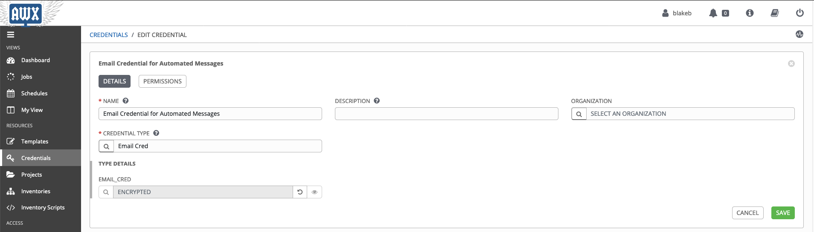
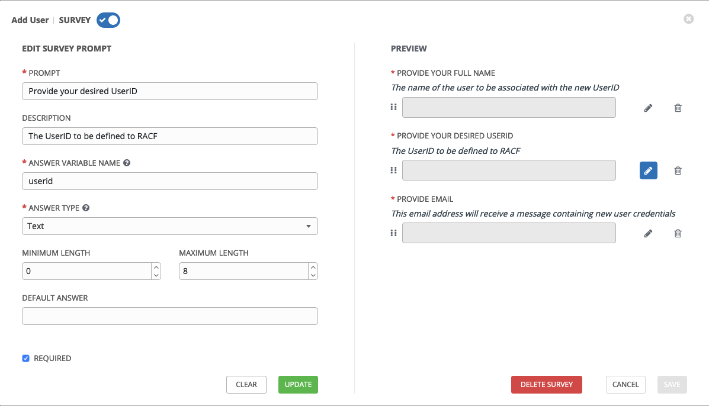
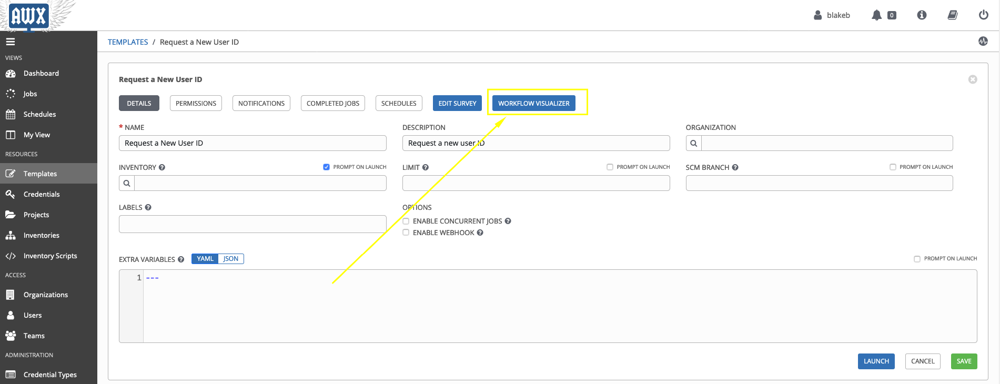
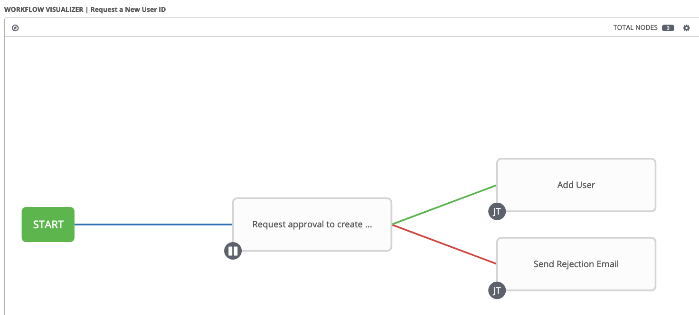

# User Management Playbook Setup for Ansible Tower

## Step 1: Create a new project

Create a new project in Ansible Tower, using the Z Ansible sample repo as the SCM URL.


## Step 2: Create a new inventory

Create a new inventory if you do not already have one to use for this project.


## Step 3: Add a new host to inventory / update existing host in inventory

The host in Ansible Tower will hold host-specific variables that are required for the add and remove user playbooks. If a variable is not specified, the default specified in the [add-zos-user](roles/add-zos-user/defaults/main.yml) and [remove-zos-user](roles/remove-zos-user/defaults/main.yml) roles will be used depending on the playbook. Please refer to each role to see the complete set of variables.

The host will **always** need to contain the following variables:

```yaml
# The name of the host to connect to, if different from the alias you wish to give to it.
ansible_host: zos_target_address

# The user name to use when connecting to the host
ansible_user: zos_target_username

# The path to the of IBM python installation binary
ansible_python_interpreter: path_to_python_interpreter_binary_on_zos_target

# The path to the root of IBM python installation
pyz: path_to_python_installation_on_zos_target

# The path to root of ZOAU installation
zoau: path_to_zoau_installation_on_zos_target

# The environment variables that should be set on z/OS host when running playbook.
# You should not need to change environment_vars
environment_vars:
  _BPXK_AUTOCVT: "ON"
  ZOAU_HOME: "{{ ZOAU }}"
  ZOAU_ROOT: "{{ ZOAU }}"
  PYTHONPATH: "{{ ZOAU }}/lib"
  LIBPATH: "{{ ZOAU }}/lib:{{ PYZ }}/lib:/lib:/usr/lib:."
  PATH: "{{ ZOAU }}/bin:{{ PYZ }}/bin:/bin:/usr/sbin:/var/bin"
  _CEE_RUNOPTS: "FILETAG(AUTOCVT,AUTOTAG) POSIX(ON)"
  _TAG_REDIR_ERR: "txt"
  _TAG_REDIR_IN: "txt"
  _TAG_REDIR_OUT: "txt"
  LANG: "C"
```

Some variables specific to user management:

- #### **default_group**

  Specifies the name of a RACF-defined group to be used as the default group for the user.

  If you do not specify a group, RACF uses your current connect group as the default.

- #### **default_group_authority**

  Specifies the level of group authority for the new user in the default group.

  The valid group authority values are USE, CREATE, CONNECT, and JOIN, as described in Group authorities.

  If you omit this operand or specify AUTHORITY without group-authority, the default value is USE.
  This operand is group-related. If a user is connected to other groups (with the CONNECT command),
  the user can have a different group authority in each group.

- #### **owner**

  Specifies a RACF-defined user or group to be assigned as the owner of the RACF profile for the user being added.

  If you omit this operand, you are defined as the owner.

- #### **user_catalog**

  Specifies the user catalog entryname for which an alias will be defined.


- #### **master_catalog**

  Identifies the catalog in which the alias is defined. If the catalog's volume is physically mounted, it is dynamically allocated. The volume must be mounted as permanently resident or reserved.

- #### **generate_password**

  Specifies if a random password should be generated when no password is provided.

- #### **generate_passphrase**

  Specifies if a random passphrase should be generated when no passphrase is provided.

- #### **security_label**

  Specifies the user's default security label, where security-label is an installation-defined
  security label name that represents an association between a particular security level and
  zero or more security categories.

  If the user does not enter a security label when entering the system, and none is assigned based
  on the user's port of entry, this value becomes the user's current security label.

  A security label corresponds to a particular security level (such as CONFIDENTIAL) with a set of
  zero or more security categories (such as PAYROLL or PERSONNEL).

- #### **security_level**

  Specifies the user's security level, where security_level is an installation-defined security
  level name that must be a member of the SECLEVEL profile in the SECDATA class.

  The security_level that you specify corresponds to the number of the minimum security level
  that a user must have to access the resource.

- #### **security_categories**

  Specifies one or more names of installation-defined security categories.

  The names you specify must be defined as members of the CATEGORY profile in a SECDATA class.
  security_categories must be provided as a list.

- #### **omvs_gid**

  Specifies the group identifier. The GID is a numeric value from 0 - 2 147 483 647.

  If no GID specified, the default is used.

- #### **omvs_zfs_data_set_size**

  Specifies amount of space, in cylinders, to allocate for the ZFS data set.

  Provided value is used for primary and secondary space.

  If left blank, defaults to 50 CYL.

- #### **bpxprm_data_set**

  Specifies the data set which contains BPXPRMxx members to modify.

- #### **bpxprm_member**

  Specifies the last 2 characters (xx) of the BPXPRMxx member
  in SYS1.PARMLIB to which a mount command for new user's ZFS data set will be added.

  If not specified, no persistent mount will be made for new ZFS data set.

- #### **tso_logon_procedure**

  Specifies the name of the user's default logon procedure when logging on through the TSO/E logon panel.

  The name you specify must be 1 - 8 alphanumeric characters and begin with an alphabetic character.

  The name must also be defined as a profile in the TSOPROC general resource class.

- #### **dfp_data_application**

  Specifies an 8-character DFP data application identifier.

- #### **data_class**

  Specifies the default data class. The maximum length of data-class-name is 8 characters.

  A data class can specify some or all of the physical data set attributes associated with a new data set.

  During new data set allocation, data management uses the value you specify as a default unless it is
  preempted by a higher priority default, or overridden in some other way, for example by JCL.

- #### **management_class**

  Specifies the default management class. The maximum length of management-class-name is 8 characters.

  A management class contains a collection of management policies that apply to data sets.

  Data management uses the value you specify as a default unless it is preempted by a higher priority default,
  or overridden in some other way, for example by JCL.

- #### **storage_class**

  Specifies the default storage class. The maximum length of storage-class-name is 8 characters.

  A storage class specifies the service level (performance and availability) for data sets managed by the
  storage management subsystem (SMS).

  During new data set allocation, data management uses the value you specify
  as a default unless it is preempted by a higher priority default,
  or overridden in some other way (for example, by JCL).

- #### **groups_to_connect**

  A list of groups to which the user should be added.

  Parameters:

  - **group**: Specifies a RACF-defined group. If you omit this operand, the user is connected to or modified in your current connect group.

  - **owner**: Specifies a RACF-defined user or group to be assigned as the owner of the connect profile. If you are creating a connection and you do not specify an owner, you are defined as the owner of the connect profile.

  - **authority**: Specifies the level of authority the user is to have in the group.
  The valid group authority values are USE, CREATE, CONNECT, and JOIN. If you are creating a connection and omit AUTHORITY or enter it without a value, the default is USE. You cannot give a user a higher level of authority in the group than you have.

  Example:

  ```yaml
    groups_to_connect:
      - group: "PAYROLL"
        owner: "PAYROLL"
        authority: "USE"
      - group: "RESEARCH"
        owner: ""
        authority: "CREATE"
  ```

- #### **resources_to_permit**

  A list of resources the user should be permitted to access.

  Parameters:

  - **profile**: Specifies the name of an existing discrete or generic profile whose access list you want to modify.

  - **authority**: Specifies the access authority you want to associate with the user being created. RACF sets the access authority in the standard access list. If you specify WHEN, RACF sets the access authority in the conditional access list. The valid access authorities are NONE, EXECUTE (for DATASET, PROGRAM, or APPCTP class only), READ, UPDATE, CONTROL, and ALTER.

  - **id**: Specifies the user IDs and group names of RACF-defined users or groups whose authority to access the resource you are giving, removing, or changing. If id is empty, default id is set to the userid of the user being created.

  Example:

  ```yaml
    resources_to_permit:
    - profile: "WJE10.DEPT2.DATA"
      authority: "UPDATE"
      id: "SYSPROG"
    - profile: "RESEARCH.PROJ01.DATA"
      authority: "READ"
      id: ""
  ```

- #### **target_charset**

  Specifies the character set any copied templates and files should be converted to.


## Step 4: Add SSH key credential for host


## Step 5: Create custom credential to hold email password

The new credential type will be used to store the password for the email account used to send out credential information and rejection emails.


## Step 6: Add email credential using custom credential type



## Step 7: Create *Add User* template

Be sure to attach both the SSH key and email credentials to the *CREDENTIALS* section.

This guide assumes you will use the same SSH key credential for all managed systems. If this is not the case, select *PROMPT ON LAUNCH*.

You can decide whether to attach the inventory created in step 2 or prompt for an inventory on launch. If you plan to support user creation on multiple hosts, select *PROMPT ON LAUNCH*.

You will need to set the following variables in the *EXTRA VARIABLES* section of the template:

- #### **print_pass**

  Specifies if a password and/or passphrase should be printed to the console upon completion of the playbook.

- #### **send_email**

  Specifies if an email should be sent containing new user credentials.

- #### **smtp_server**

  Specifies the SMTP server to use for sending email

- #### **smtp_port**

  Specifies the SMTP port to use for sending email

- #### **smtp_username**

  Specifies the username to use for sending email

Ensure `print_pass: no` and `send_email: yes`. The remaining variables will need to be set based on your email provider and credentials.


## Step 8: Add survey prompt for the *Add User* template





## Step 9: Create *Remove User* template

Be sure to attach the SSH key credential to the *CREDENTIALS* section.

This guide assumes you will use the same SSH key credential for all managed systems. If this is not the case, select *PROMPT ON LAUNCH*.

You can decide whether to attach the inventory created in step 2 or prompt for an inventory on launch. If you plan to support user creation on multiple hosts, select *PROMPT ON LAUNCH*.


## Step 10: Add survey prompt for the *Remove User* template


## Step 11: Create *Send Rejection Email* template

Be sure to attach the email credential to the *CREDENTIALS* section.

You can decide whether to attach the inventory created in step 2 or prompt for an inventory on launch. If you plan to support user creation on multiple hosts, select *PROMPT ON LAUNCH*.

Technically, the specific host used in this step does not matter, as the *send-rejection-email.yml* playbook will always run on the control node.

You will need to set the following variables in the *EXTRA VARIABLES* section of the template:

- #### **smtp_server**

  Specifies the SMTP server to use for sending email

- #### **smtp_port**

  Specifies the SMTP port to use for sending email

- #### **smtp_username**

  Specifies the username to use for sending email


## Step 12: Create *Request a New User ID* workflow template

You can decide whether to attach the inventory created in step 2 or prompt for an inventory on launch. If you plan to support user creation on multiple hosts, select *PROMPT ON LAUNCH*.


## Step 13: Navigate to *WORKFLOW VISUALIZER* panel



## Step 14: Add *Request Approval* step to workflow template


## Step 15: Add *Add User* step to workflow template


## Step 16: Add *Send Rejection Email* step to workflow template


## Step 17: Verify workflow template looks like the following



## Step 18: Add survey prompt for the *Request a New User ID* workflow template


## Step 19: Give desired users / teams access to inventory


## Step 19: Give desired users / teams access to the *Request a New User ID* workflow template

Ensure you only give users access to the *Request a New User ID* workflow template and not the *Add User* and *Remove User* templates, as they do not require an approver to run individually.


# Copyright

© Copyright IBM Corporation 2020

# License

Licensed under [Apache License,
Version 2.0](https://opensource.org/licenses/Apache-2.0).